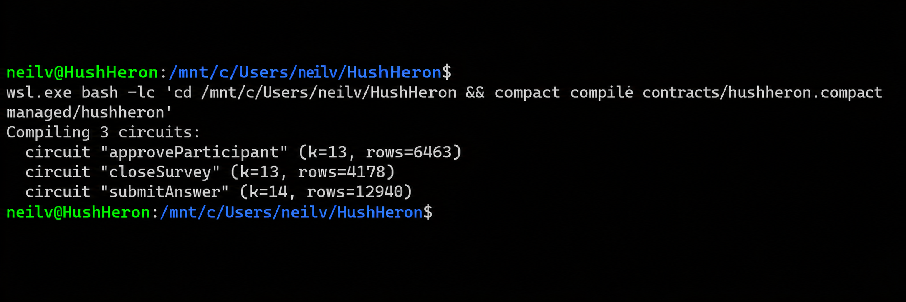
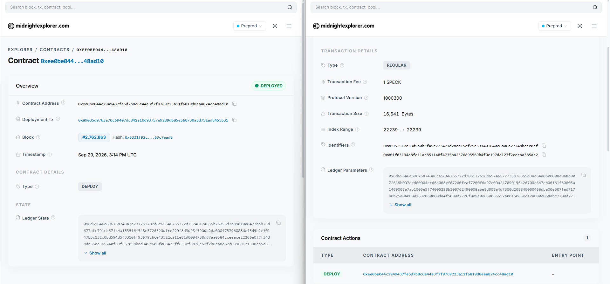
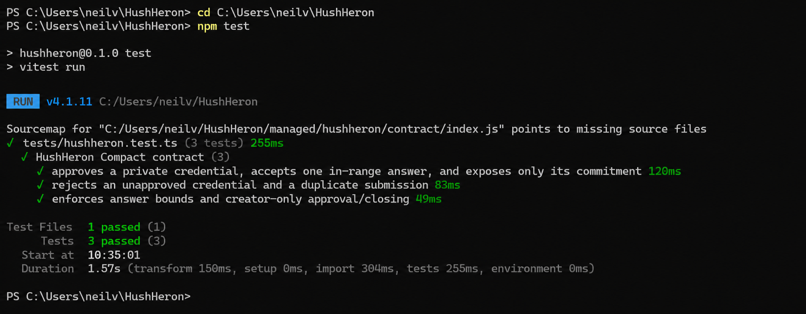

# HushHeron

> Verified feedback without revealing who said it.

HushHeron is a private survey dApp on Midnight Preprod. A creator approves a participant's credential commitment; the participant proves eligibility, a valid 1–5 answer, and one use of that credential without putting their identity or answer on the ledger. Each survey has its own Compact contract. The creator computes aggregate results from browser-encrypted answers.

## Submission links

| Item | Evidence |
| --- | --- |
| Public repository | [GitHub source and commit history](https://github.com/venoxv/hushheron) |
| Live app | [hushheron.vercel.app](https://hushheron.vercel.app/) |
| Demo video | [HushHeron demo on Google Drive](https://drive.google.com/file/d/1BrjzJhNZ14aIXittilkkK6KEFxqNIbLe/view?usp=sharing) |
| Preprod deployment | [Contract `ee0be044…48ad10`](https://preprod.midnightexplorer.com/contracts/0xee0be044c2949437fe5d7b8c6e44e3f7f9769223a11f6819d8eaa824cc48ad10) · [deployment transaction](https://preprod.midnightexplorer.com/transactions/0x89035d9763a70c69407dc842a10d93757e9289d685eb60730a5d751ad8455b31) · [screenshot](public/deployedcontract.png) |
| Preprod circuit call | [Successful `submitAnswer` transaction](https://preprod.midnightexplorer.com/transactions/0x08c4c9a5ef7a67a80c20edab12b860b12f279b5b602856f83cbfc754df48db59) on [survey contract `0d14bbd8…05722`](https://preprod.midnightexplorer.com/contracts/0x0d14bbd8335271fa45d0ae9f2cbce4bf1bd261e56dd660febee79d437ab05722) |
| CI | [](https://github.com/venoxv/hushheron/actions/workflows/ci.yml) · [passing run](https://github.com/venoxv/hushheron/actions/runs/36665358984) |
| Proposal | [Anonymous Feedback / Survey proposal](PROPOSAL.md); organizer approval has not been evidenced |

The deployment screenshot and `submitAnswer` transaction refer to different surveys, each with its own contract. The public app is reachable, but its hosted survey directory was empty when checked on September 30, 2026; persistent hosted end-to-end operation is not yet evidenced.

## What This Does

The creator writes one scale question, publishes a survey, shares its link, approves participant credential commitments, and reads verified counts and the aggregate in their browser. A participant requests approval, connects a compatible Midnight wallet, privately proves eligibility, and submits once. The success state appears only after the Midnight call finalizes and its encrypted answer syncs to the directory.

## Privacy Model

| Viewer | What they can learn | What they cannot learn from the app or ledger |
| --- | --- | --- |
| Ledger observer | Approved credential commitments, one-use nullifiers, answer commitments, counts, and contract status | Credential secret, Merkle path, or plaintext answer |
| App directory reader | Survey text and encrypted answer candidates | Answer plaintext or creator decryption key |
| Creator with the private backup | Individual decrypted answers and their aggregate | A stored wallet-to-answer mapping |

The private witness contains the participant's credential secret, Merkle path, answer, and answer salt. The Compact circuit proves approved membership, a valid 1–5 answer, and one use per credential. Only commitments, nullifiers, and counts become public contract state. The creator authorization secret and decryption key remain in the creator's browser or their exported backup.

The creator's browser decrypts individual ciphertexts to calculate the aggregate, so the creator key holder can technically inspect individual answers. The app stores no wallet-to-answer field or request timestamps, but transaction timing, wallet fee activity, IP addresses in infrastructure logs, and small anonymity sets can still weaken anonymity. Use a locally controlled proof server in the wallet when strict witness privacy matters: [Midnight's proof-server guide](https://docs.midnight.network/guides/run-proof-server) states that the proving service sees private inputs. The wallet's proving modality controls whether proving stays local.

The demo directory accepts multiple encrypted candidates for a public answer commitment. The creator view counts only a ciphertext that decrypts to a valid answer and salt matching the on-chain commitment, so an invalid upload cannot claim that commitment first. The unauthenticated directory still needs rate limits and durable storage before public use. Creator and participant secrets currently reside in browser localStorage, which is accessible to same-origin scripts; stronger key custody is needed before production. The in-memory Midnight private-state provider also loses the generated maintenance signing key on browser refresh, so contract upgrades require a durable encrypted provider.

The contract enforces one answer **per approved credential**, not one per human by itself. A creator must authenticate each requester through a separate trusted channel, match the approval code, and approve only one code per person. Approving anonymous requests indiscriminately would not establish real-world eligibility.

This is a code-level privacy claim backed by generated-contract tests and an on-chain `submitAnswer` call. It is not a live-wallet anonymity audit.

## Tech Stack

Next.js, React, TypeScript, Tailwind CSS, Midnight.js 4.1.1, DApp Connector API 4.0.1, Compact compiler 0.31.1, Compact runtime 0.16.0, and a Node JSON directory for local or single-instance hosting. Versions match the [Midnight compatibility matrix](https://docs.midnight.network/relnotes/support-matrix).

## Prerequisites

- Node.js 22 and npm 10+
- Compact devtools and compiler 0.31.1; on Windows, use WSL for compilation
- Lace or another Connector API 4.x wallet on Preprod, with faucet tNIGHT registered to accrue DUST
- A wallet-controlled proof server, preferably local for private witnesses
- A writable persistent directory for hosted survey metadata and encrypted answers

## Setup & Run Locally

1. Clone this repository and run `npm ci`.
2. In WSL, run `compact update 0.31.1`, then `npm run compact` from the repository path. On Windows PowerShell, the `compact` command can resolve to the Windows file-compression utility, so compile inside WSL.
3. Run `npm run dev`. The predev script copies compiled keys and ZKIR into `public/managed/`.
4. Open `http://localhost:3000`, connect a funded Preprod wallet, and create a survey.
5. Use another browser profile or device for a participant credential. Request approval, send the approval code to the creator through a trusted channel, approve that exact code from the creator view, then answer and submit.

For a persistent single-instance host, build the included container with `docker build -t hushheron .` and run it with a durable volume: `docker run -p 3000:3000 -v hushheron-data:/data hushheron`. Configure HTTPS and a public hostname. Do not run multiple replicas against this JSON directory. The container build has not been verified here; the local Node production build passed.

For local proof-server setup, follow the [official guide](https://docs.midnight.network/guides/run-proof-server) using `midnightntwrk/proof-server:8.1.0`; point the wallet's proving setup at that local service. The wallet extension controls transaction authorization and fee payment.

## Verify locally

```bash
npm run verify
```

This runs tests, typechecking, linting, and a production build. The suite currently has 10 passing tests, including three generated-contract tests for eligibility, replay protection, answer bounds, creator authorization, closure, and public ledger state. The [test screenshot](public/3test.png) captures the three Compact tests; the [CI run](https://github.com/venoxv/hushheron/actions/runs/36665358984) verifies the full pipeline on the published repository.

## CI/CD

[The CI workflow](.github/workflows/ci.yml) installs Node 22 and Compact 0.31.1, recompiles the contract, then runs tests, typechecking, linting, and a production build on pushes to `main` and pull requests. Its [run for commit `f5fbb0d`](https://github.com/venoxv/hushheron/actions/runs/36665358984) passed.

## Product Proposal

The selected idea from the organizer's list is **Anonymous Feedback / Survey**. See [PROPOSAL.md](PROPOSAL.md). No Rise In submission or approval receipt has been provided, so approval remains pending.

## Initial Idea

Anonymous feedback is most useful when people can trust both sides: participants need their words separated from identity, and creators need confidence that responses came from eligible people only once. HushHeron uses a private credential with a public approval commitment, a one-use nullifier, and an encrypted answer to provide that balance for small teams and communities.

## Screenshot evidence

| Compact compile: three circuits | Preprod contract and address | Three Compact tests passing |
| --- | --- | --- |
| [](public/successcompile.png) | [](public/deployedcontract.png) | [](public/3test.png) |

## Level 1–3 submission status

| Level | Requirement | Status and direct evidence |
| --- | --- | --- |
| 1 | Toolchain, compiling contract, generated circuits and keys | **Met:** [compile screenshot](public/successcompile.png), [Compact source](contracts/hushheron.compact), [tracked `managed/hushheron/`](managed/hushheron/) |
| 1 | Passing tests | **Met:** [three-test screenshot](public/3test.png) and [CI run](https://github.com/venoxv/hushheron/actions/runs/36665358984) |
| 1 | Preview or Preprod deployment with address | **Met:** [Preprod contract](https://preprod.midnightexplorer.com/contracts/0xee0be044c2949437fe5d7b8c6e44e3f7f9769223a11f6819d8eaa824cc48ad10) and [screenshot](public/deployedcontract.png) |
| 1 | Public repository, setup, public/private explanation, idea paragraph, 5+ commits | **Met:** [repository](https://github.com/venoxv/hushheron), [setup](#setup--run-locally), [privacy model](#privacy-model), [initial idea](#initial-idea), [commit history](https://github.com/venoxv/hushheron/commits/main/) |
| 2 | Lace connect/disconnect and frontend circuit integration | **Implemented:** [wallet UI](src/components/wallet-provider.tsx), [Midnight integration](src/lib/midnight-client.ts), [demo video](https://drive.google.com/file/d/1BrjzJhNZ14aIXittilkkK6KEFxqNIbLe/view?usp=sharing) |
| 2 | Successful circuit call, privacy behavior, Preprod address | **On-chain call verified:** [`submitAnswer` transaction](https://preprod.midnightexplorer.com/transactions/0x08c4c9a5ef7a67a80c20edab12b860b12f279b5b602856f83cbfc754df48db59), [privacy model](#privacy-model), [deployment](https://preprod.midnightexplorer.com/contracts/0xee0be044c2949437fe5d7b8c6e44e3f7f9769223a11f6819d8eaa824cc48ad10) |
| 2 | Public live link, video, 8+ commits | **Provided:** [live app](https://hushheron.vercel.app/), [video](https://drive.google.com/file/d/1BrjzJhNZ14aIXittilkkK6KEFxqNIbLe/view?usp=sharing), [commits](https://github.com/venoxv/hushheron/commits/main/) |
| 3 | Functional dApp and 3+ tests | **Partly evidenced:** on-chain `submitAnswer`, frontend source, [three-test screenshot](public/3test.png). Persistent hosted survey data and a complete hosted participant-to-results run remain unverified. |
| 3 | CI workflow with passing run and 10+ commits | **Met:** [workflow](.github/workflows/ci.yml), [passing run](https://github.com/venoxv/hushheron/actions/runs/36665358984), [commit history](https://github.com/venoxv/hushheron/commits/main/) |
| 3 | Live demo, video, proposal from idea list | **Links provided:** [app](https://hushheron.vercel.app/), [video](https://drive.google.com/file/d/1BrjzJhNZ14aIXittilkkK6KEFxqNIbLe/view?usp=sharing), [proposal](PROPOSAL.md). **Pending:** Rise In submission and organizer approval evidence. |

## Hosting note

The included directory writes JSON to `HUSHHERON_DATA_DIR` with a single-process mutation queue. Use a persistent disk and one Node process for a demo deployment. Serverless ephemeral storage or multiple replicas can lose or race survey metadata; migrate this directory to a durable database before wider use. Responses are encrypted client-side, and the directory does not store wallet addresses or answer plaintext.

## Attribution

The in-memory browser private-state provider is adapted from the [Midnight leaderboard example](https://github.com/midnightntwrk/midnight-leaderboard). Contract and SDK integration follow [Midnight's generated-contract](https://docs.midnight.network/guides/compact-javascript-runtime) and [deployment](https://docs.midnight.network/guides/deploy-and-operate) guides.
